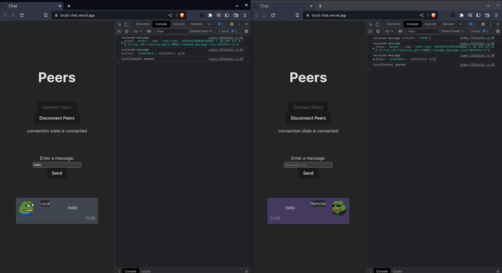

# Peers Chat


This project is a demo for WebRTC which is an open web standard that enables peer to peer real time communication between browsers

built with react only without extra dependencies 
and deployed on vercel [live](https://peers-chat.vercel.app/)


as shown in the above diagram the two broswers that want to establish a connection should do so through a signaling server, once the conncetion is set, the two browsers can communicate directly without intermediary servers (STUN case)


**in this demo, I used**:
>  ```BroadcastChannel``` broswer API *as* a signaling server 
> 
>  two tabs of the same browser *as* two clients who want to communicate 


### usage 

- once you open two tabs of the app and click on `connect peers` button 
- the `BroadcastChannel` API setup the webRTC connection between two tabs
- after seeing the connection state as `connected` you can send message between peers
> note: you can see the communication done by the signaling server through console messages

### screenshot



#### P.S this demo is still under development and improvement